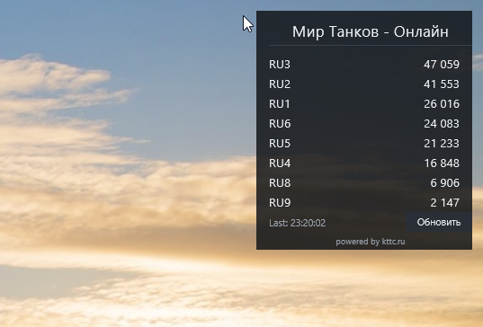

# Мир Танков - Онлайн для Rainmeter

Небольшой виджет Rainmeter для Windows 10/11. Показывает онлайн серверов «Мир Танков» с сайта kttc.ru, сортирует серверы от большего онлайна к меньшему и обновляет данные раз в 15 минут.



## Что умеет

- показывает онлайн по серверам RU;
- сортирует серверы по онлайну;
- форматирует числа с пробелами: `47 000`;
- показывает время последнего обновления;
- имеет кнопку `Обновить`;
- источник данных указан внизу: `powered by kttc.ru`.
- фон задан в коде, дополнительную прозрачность можно настроить средствами Rainmeter.

## Установка для новичка

1. Установите Rainmeter: https://www.rainmeter.net/
2. Откройте страницу релиза проекта на GitHub.
3. Скачайте файл `MirTankovOnline-v1.0.0.rmskin` из [релиза](https://github.com/jekeam/mir-tankov-online-rainmeter/releases) блока `Assets`.
4. Дважды кликните по скачанному `.rmskin` файлу.
5. В окне Rainmeter Skin Installer нажмите `Install`.
6. Виджет появится на рабочем столе.

Если виджет не появился:

1. Нажмите правой кнопкой по иконке Rainmeter в трее.
2. Откройте `Manage`.
3. Найдите `KttcOnline`.
4. Выберите `KttcOnline.ini`.
5. Нажмите `Load`.

## Обновление данных

Виджет обновляет данные автоматически раз в 15 минут. Для ручного обновления нажмите кнопку `Обновить`.

Для работы нужен доступ к сайту:

```text
https://kttc.ru/wot/ru/info/servers-online/
```

## Сборка из исходников

Запустите PowerShell из папки проекта:

```powershell
powershell -ExecutionPolicy Bypass -File .\build\Build-Rmskin.ps1
```

Готовый пакет появится в папке `dist`.

## Структура проекта

```text
RainmeterSkin/KttcOnline/        исходники скина
RainmeterSkin/KttcOnline/@Resources/Data.inc
build/Build-Rmskin.ps1           сборка .rmskin пакета
docs/images/preview.png          пример виджета
dist/                            готовые сборки
```

## Источник данных

Данные берутся с сайта kttc.ru. Проект не связан с kttc.ru и не является официальным виджетом.
